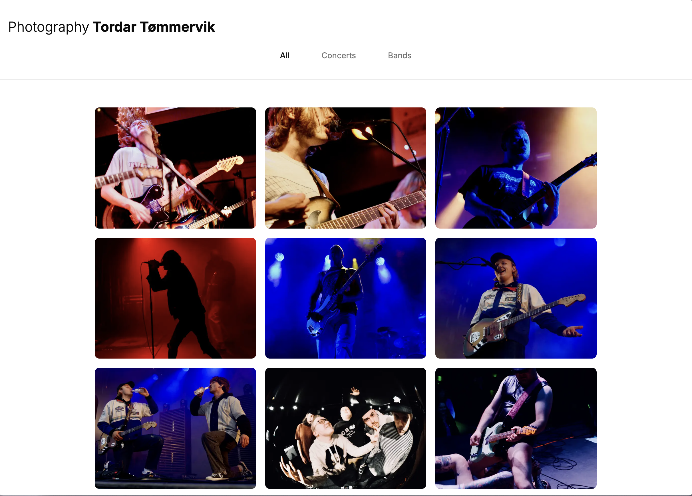
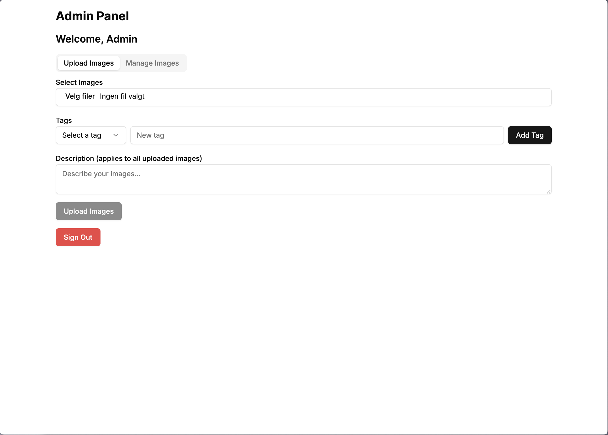
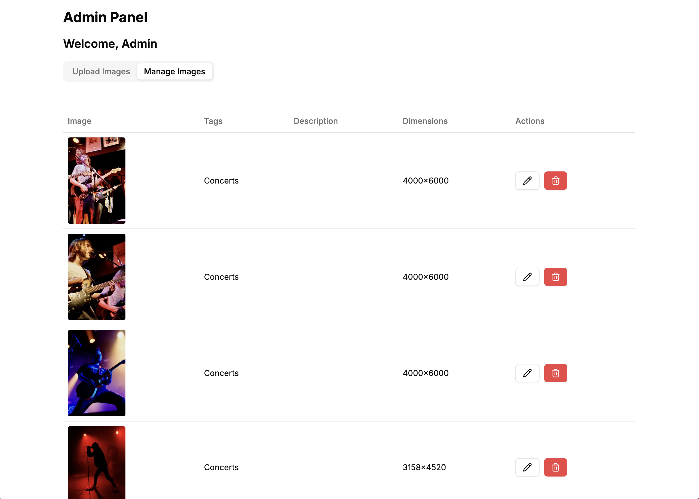

# 📸 Photography Portfolio - Tordar Tømmervik 📸

A modern photography portfolio website built with Next.js and a custom admin panel solution 

## Features

- **Gallery View**: Clean, responsive grid layout showcasing photography
- **Tag-based Filtering**: Browse images by categories
- **Admin Panel**: Secure image upload and management system
- **Image Management**: Upload, tag, and organize your photography collection
- **Responsive Design**: Optimized for all device sizes

## Screenshots

<div align="center">

| Main Gallery | Admin Panel - Upload | Admin Panel - Manage |
|:------------:|:-------------------:|:-------------------:|
|  |  |  |
| *Main gallery view with tag filtering* | *Upload images interface* | *Manage existing images* |

</div>

## Getting Started

First, run the development server:

```bash
npm run dev
# or
yarn dev
# or
pnpm dev
# or
bun dev
```

Open [http://localhost:3000](http://localhost:3000) with your browser to see the result.

## Technology Stack

- **Next.js 14** - React framework with App Router
- **TypeScript** - Type-safe development
- **Shadcn** - React component library
- **Tailwind CSS** - Utility-first CSS framework
- **Supabase** - Backend as a Service for image metadata
- **Vercel blob store** - Native vercel blob storage for storing images
- **NextAuth.js** - Authentication for admin access

## Project Structure

```
src/
├── app/
│   ├── admin/           # Admin panel pages
│   ├── api/            # API routes for image management
│   ├── components/     # Reusable UI components
│   └── page.tsx        # Main gallery page
├── components/ui/      # Shadcn/ui components
└── lib/               # Utility functions and configurations
```

## Admin Features

- **Image Upload**: Drag and drop or select multiple images
- **Tag Management**: Add and organize image tags
- **Metadata Editing**: Update descriptions and manage image details
- **Bulk Operations**: Manage multiple images at once
- **Secure Access**: Protected admin routes with authentication

## Deployment

The easiest way to deploy the app is to use [Vercel](https://vercel.com/new?utm_medium=default-template&filter=next.js&utm_source=create-next-app&utm_campaign=create-next-app-readme) 


